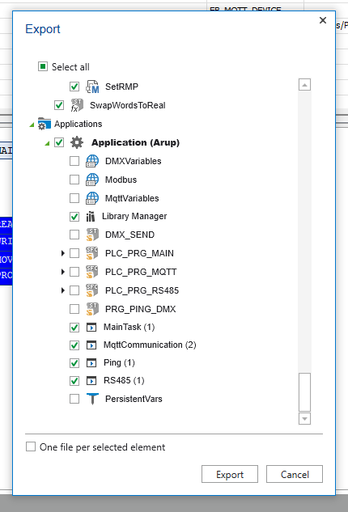

## Merge request (pull request)

## **GIT side**

1. Create own fork (if you not already did)
2. Don't change the default `.ecp` for your own config
3. Optional: Create branch
4. Code
5. Prepare for export, see below. Add documentation
6. Create merge/pull request from your repo to this.

## **Prepare for export**

An export contains `.export` and `.xml` for people to update. The `.ecp` is upgraded to the new changes, so its a basic version for newcomers.

1. Save file the `.ecp`

   - Make sure the original ecp is **unmodified**
   - Save with another name.

2. Run export (from your modified ecp)

   - Export all files except the `automation`
     
   - You can export Variables/Library if you see fit
     - Codesys v3 >>> [Exports\PLCopen.xml](/src/Exports/PLCopen.xml)
     - PLCopen XML >>> [Exports\CodesysV3.export](/src/Exports/CodesysV3.export)

3. Open the original `.ecp`. Keep your config out.
   - Follow [this guide](/docs/FAQ/Howto_updating_function_blocks.md) to update your blocks
